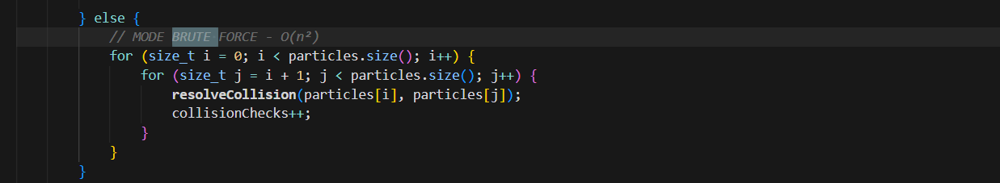
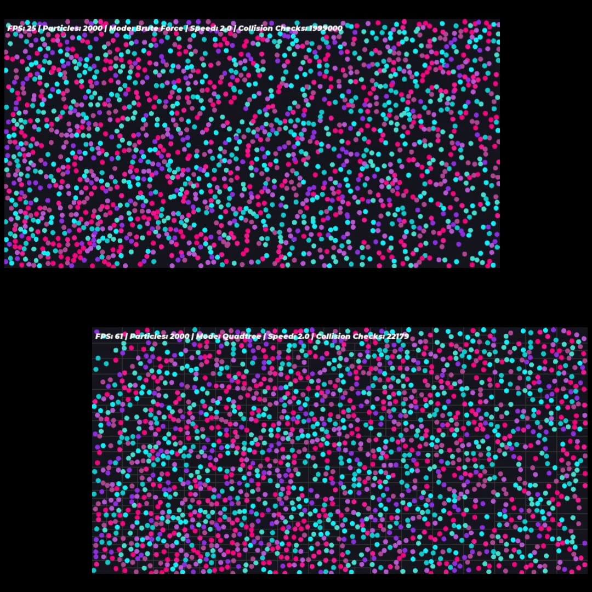

# Partikel Effect

Proyek ini dibuat menggunakan **SFML** untuk menampilkan animasi sederhana berupa lingkaran (particle) yang memantul di dalam jendela.  
Program ini juga menggunakan **delta time** dan **collision detection** untuk menghasilkan gerakan yang halus.

---

## Fitur dan Progres

- Particle dasar: lingkaran bergerak dan memantul di dalam window  
- Update posisi & kecepatan menggunakan delta time  
- Collision resolution (Brute Force)  
- Quadtree untuk optimasi pencarian partikel tetangga  
- Cursor pull effect (partikel tertarik ke cursor)  
- UI Text menampilkan FPS, jumlah partikel, mode, dan speed  
- Penyesuaian speed factor menggunakan tombol Up/Down  
- Menambah/mengurangi partikel menggunakan tombol Q/W  
- Font dan styling UI menggunakan Montserrat / font aesthetic  
- Progress commits dibuat per fitur/progres

---

## Cara Menjalankan

1. Pastikan **SFML 3.x** sudah terinstall dan terhubung ke project.  
2. Compile program menggunakan **g++** atau compiler lain yang kompatibel dengan SFML.  
3. Jalankan executable, jendela animasi akan terbuka.  
4. Kontrol:
   - `Num1` → Mode brute force  
   - `Num2` → Mode quadtree  
   - `Up` / `Down` → Ubah kecepatan global partikel  
   - `Q` → Tambah 100 partikel  
   - `W` → Hapus 100 partikel

---

## Struktur Folder


# Partikel Effect 

Progress pada program ini dibuat menggunakan SFML untuk menampilkan animasi sederhana berupa lingkaran yang memantul di dalam jendela.  

Proyek ini juga menggunakan perhitungan waktu (delta time) dan deteksi tumbukan (collision detection) untuk menghasilkan gerakan yang halus.

# ✨ Particle Collision Simulation

<div align="center">


**Real-time particle physics simulation dengan Quadtree optimization dan aesthetic visual design**

[Demo Video](#-demo) • [Features](#-features) • [Installation](#-installation) • [Controls](#-controls)

</div>

---

## 🎯 Overview

Proyek ini adalah **real-time particle physics simulator** yang mendemonstrasikan perbedaan performa antara **Brute Force** dan **Quadtree** collision detection. Program ini dibuat menggunakan **SFML 3.x** dengan fokus pada optimasi algoritma spatial partitioning.

### 🌟 Highlights

- 🎨 **Aesthetic Color Palette** - Galaxy-Holographic themed particles
- ⚡ **Optimized Collision Detection** - Quadtree spatial partitioning
- 🎮 **Interactive Controls** - Real-time manipulation & parameter adjustment
- 📊 **Performance Metrics** - Live FPS, particle count, dan collision check counter
- 🎪 **Smooth Physics** - Delta time calculation & elastic collision resolution

---

## 🔬 Collision Detection: Brute Force vs Quadtree

### 🐌 **Brute Force Method** - O(n²)

**Cara Kerja:**
Brute force mengecek **SETIAP partikel dengan SEMUA partikel lainnya** tanpa pengecualian.

```
Untuk 100 partikel:
  Partikel #1 cek dengan #2, #3, #4, ..., #100  (99 checks)
  Partikel #2 cek dengan #3, #4, ..., #100      (98 checks)
  Partikel #3 cek dengan #4, ..., #100          (97 checks)
  ...
  Total = 99 + 98 + 97 + ... + 1 = 4,950 checks!
```

**Formula:**
```
Jumlah Collision Checks = n × (n-1) / 2
```

**Masalah:**
- ❌ **Exponential growth** - 100 partikel = 5K checks, 1000 partikel = 500K checks
- ❌ **Wasted computation** - Mengecek partikel yang jauh dan tidak mungkin bertumbukan
- ❌ **Frame drops** - Performa menurun drastis saat partikel > 500
- ❌ **Tidak scalable** - Tidak cocok untuk simulasi besar

**Contoh Perhitungan:**
| Particles | Collision Checks | FPS Impact |
|-----------|------------------|------------|
| 100       | 4,950           | ~60 FPS    |
| 300       | 44,850          | ~45 FPS    |
| 500       | 124,750         | ~20 FPS ❌ |
| 1000      | 499,500         | ~5 FPS ❌❌ |

---

### 🚀 **Quadtree Method** - O(n log n)

**Cara Kerja:**
Quadtree membagi ruang simulasi menjadi **hierarki sel-sel lebih kecil**, sehingga setiap partikel hanya perlu mengecek partikel di **area sekitarnya** saja.

```
STEP 1: Divide ruang jadi 4 kuadran
┌─────────┬─────────┐
│   NW    │   NE    │  
├─────────┼─────────┤
│   SW    │   SE    │
└─────────┴─────────┘

STEP 2: Jika kuadran terlalu penuh (> capacity), subdivide lagi
┌───┬───┬─────────┐
│ ▪ │ ▪ │    ▪    │  ▪ = particles
├───┼───┤    ▪    │
│ ▪ │ ▪ │         │  Setiap cell: max 4-6 particles
├───┴───┼─────────┤
│   ▪   │    ▪    │
└───────┴─────────┘

STEP 3: Query collision hanya di nearby cells
Partikel di NW hanya cek dengan:
✅ Partikel di cell yang sama
✅ Partikel di cell tetangga
❌ SKIP partikel di SE (terlalu jauh)
```

**Keuntungan:**
- ✅ **Logarithmic complexity** - Jauh lebih efisien untuk data besar
- ✅ **Spatial culling** - Tidak mengecek partikel yang terlalu jauh
- ✅ **Consistent FPS** - Performa stabil bahkan dengan 1000+ partikel
- ✅ **Industry standard** - Digunakan di game engine (Unity, Unreal)

**Mengapa Hanya Cek "Yang Bersentuhan Dinding Cell"?**

Quadtree bekerja dengan prinsip **spatial locality** - partikel yang **dekat secara posisi** lebih mungkin bertumbukan. 

Ketika partikel berada di **boundary (dinding) cell**, ia bisa bertumbukan dengan:
1. Partikel di **cell yang sama**
2. Partikel di **cell tetangga** (berbagi dinding)

Partikel yang berada di cell yang **tidak adjacent (tidak berbatasan)** dijamin **terlalu jauh** untuk bertumbukan, sehingga **tidak perlu dicek** sama sekali!

**Visual Example:**
```
Cell A berisi Particle #1
Cell D berisi Particle #2

┌─────┬─────┐
│  A  │  B  │  Jarak A-D terlalu jauh
├─────┼─────┤  → SKIP collision check
│  C  │  D  │  → Hemat komputasi!
└─────┴─────┘
```

**Contoh Perhitungan:**
| Particles | Collision Checks | FPS Impact |
|-----------|------------------|------------|
| 100       | ~800            | ~60 FPS    |
| 300       | ~2,400          | ~60 FPS    |
| 500       | ~4,000          | ~58 FPS ✅ |
| 1000      | ~8,000          | ~55 FPS ✅✅ |

---

## 📊 Performance Comparison

### Speed-up Factor

| Particles | Brute Force | Quadtree | Speed-up |
|-----------|-------------|----------|----------|
| 100       | 4,950       | ~800     | **6x** ⚡ |
| 300       | 44,850      | ~2,400   | **18x** ⚡⚡ |
| 500       | 124,750     | ~4,000   | **31x** ⚡⚡⚡ |
| 1000      | 499,500     | ~8,000   | **62x** ⚡⚡⚡⚡ |

### Visual Comparison

**Brute Force (500 particles):**
```
🔴 FPS: 20-25
🔴 Lag terlihat jelas
🔴 Frame drops saat collision banyak
🔴 CPU usage: ~80-90%
```

**Quadtree (500 particles):**
```
🟢 FPS: 55-60
🟢 Smooth & responsive
🟢 Consistent performance
🟢 CPU usage: ~15-25%
```

---

## ✨ Features

### 🎨 Visual Features
- **Aesthetic Color Palette** - 8 warna Galaxy-Holographic (magenta, cyan, purple)
- **Dynamic Particles** - Smooth motion dengan delta time calculation
- **Quadtree Visualization** - Lihat spatial partitioning secara real-time
- **UI Dashboard** - FPS counter, particle count, mode indicator, collision checks

### ⚙️ Physics Features
- **Elastic Collision** - Momentum & energy conservation
- **Wall Bouncing** - Perfect reflection dengan restitution
- **Cursor Interaction** - Partikel tertarik ke cursor (gravitational pull)
- **Adjustable Speed** - Real-time speed factor adjustment

### 🎮 Interactive Controls
- **Mode Switching** - Toggle antara Brute Force & Quadtree
- **Particle Spawning** - Add/remove particles on-the-fly
- **Speed Control** - Adjust simulation speed
- **Performance Monitoring** - Live metrics & statistics

---

## 🎮 Controls

| Key | Action |
|-----|--------|
| `1` | Switch to **Brute Force** mode |
| `2` | Switch to **Quadtree** mode (recommended) |
| `Q` | Add 100 particles |
| `W` | Remove 100 particles |
| `↑` | Increase speed factor |
| `↓` | Decrease speed factor |
| `ESC` | Close application |

**Mouse:**
- **Hover** - Particles akan tertarik ke cursor dalam radius tertentu

---

## 🚀 Installation

### Prerequisites

- **SFML 3.x** (Graphics, Window, System modules)
- **C++17** compatible compiler (g++, clang++, MSVC)
- **CMake** (optional, recommended)

### Clone Repository

```bash
git clone https://github.com/yourusername/particle-simulation.git
cd particle-simulation
```

### Compile

**Using g++:**
```bash
g++ -std=c++17 main.cpp -o particle_sim -lsfml-graphics -lsfml-window -lsfml-system
```

**Using CMake:**
```bash
mkdir build && cd build
cmake ..
make
```

### Run

```bash
./particle_sim
```

---


## 📸 Screenshots

### 🔴 Brute Force - Performance Degradation

*500 particles - FPS drops to 20, visible lag & stuttering*

### 🟢 Quadtree - Optimized Performance

*500 particles - Stable 60 FPS, smooth & responsive*

### 📊 Side-by-Side Comparison

*Left: Brute Force (laggy) | Right: Quadtree (smooth)*

---

## 🎬 Demo

**Video Demo:**
[

*Click to watch full performance comparison demo*

---

## 🔧 Technical Details

### Collision Resolution Algorithm

```cpp
// Elastic collision dengan conservation of momentum
void resolveCollision(Particle& a, Particle& b) {
    // 1. Calculate collision normal
    // 2. Calculate relative velocity
    // 3. Apply impulse based on mass
    // 4. Separate overlapping particles
}
```

### Quadtree Implementation

```cpp
struct Quadtree {
    Rect boundary;
    int capacity = 4;  // Max particles per cell
    vector<int> particleIndices;
    
    // Subdivide if exceeds capacity
    void subdivide() {
        NE = new Quadtree(topRight, capacity);
        NW = new Quadtree(topLeft, capacity);
        SE = new Quadtree(bottomRight, capacity);
        SW = new Quadtree(bottomLeft, capacity);
    }
    
    // Query nearby particles
    void queryIndices(Rect area, vector<int>& found);
};
```

---

## 🎓 Educational Value

Proyek ini cocok untuk:
- ✅ Belajar **spatial data structures** (Quadtree)
- ✅ Memahami **algorithm complexity** (Big O notation)
- ✅ Praktik **physics simulation** & collision detection
- ✅ Optimasi performa dalam **real-time applications**
- ✅ Understanding **trade-offs** dalam software engineering

---

## 🐛 Known Issues

- Font file (`Montserrat-BlackItalic.otf`) must be in the same directory as executable
- Performance may vary based on hardware specifications
- Very high particle counts (5000+) may still cause frame drops even with Quadtree

---

## 🚀 Future Improvements

- [ ] Multithreading untuk collision detection
- [ ] GPU acceleration dengan compute shaders
- [ ] Particle trails & motion blur effects
- [ ] Variable particle sizes & masses
- [ ] Gravity & force field simulation
- [ ] Save/load simulation states
- [ ] Interactive particle spawning dengan mouse

---

## 📚 References

- [SFML Documentation](https://www.sfml-dev.org/documentation/3.0.0/)
- [Quadtree Spatial Indexing](https://en.wikipedia.org/wiki/Quadtree)
- [Elastic Collision Physics](https://en.wikipedia.org/wiki/Elastic_collision)
- [Big O Complexity Analysis](https://www.bigocheatsheet.com/)

---

## 📄 License

This project is licensed under the **MIT License** - see the [LICENSE](LICENSE) file for details.

---

## 👨‍💻 Author

**Your Name**  
📧 Email: your.email@example.com  
🌐 GitHub: [@yourusername](https://github.com/yourusername)

---

## 🙏 Acknowledgments

- **SFML Team** - For the amazing multimedia library
- **Professor [Name]** - For project guidance & algorithm insights
- **Computer Graphics Course** - Data Structures & Algorithm Optimization

---

<div align="center">

**⭐ Star this repo if you find it useful! ⭐**

Made with ❤️ and C++


</div>

